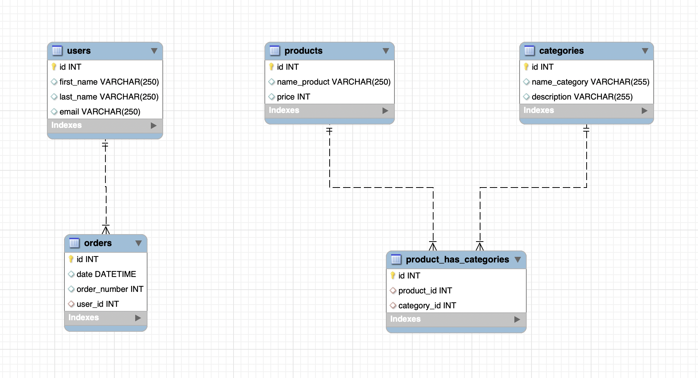

# Express and MySQL 🚀

## Objectives 🎯

In this project, our main objectives are to:

- 🔧 Handle Node.js
- 🚀 Understand how to interact with Express.js
- 📚 Learn to use Express.js
- 📦 Handle NPM
- 🏦 Learn to use MySQL with Express

### Exercise 1
- 📦 Create the database endpoint.
- 📦 Create the following tables using Express and MySQL, just as we've seen in class:
  - 📦 Products Table
  - 🗂️ Categories Table

### Exercise 2
- 📤 Create an endpoint to add a new product and add 2 new products from Postman.
- 📤 Create an endpoint to create a category and add 2 new categories from Postman.

### Exercise 3
- 🔄 Create an endpoint to update a product.
- 🔄 Create an endpoint to update a category.

### Exercise 4
- 📦 Create an endpoint that shows all the products.
- 🗂️ Create an endpoint that shows all the categories.
- 🗂️ Create an endpoint that shows all the products with their respective categories.
- 🆔 Create an endpoint where you can select a product by its ID.
- ⬇️ Create an endpoint that shows the products in descending order.
- 🆔 Create an endpoint where you can select a category by its ID.
- 🔍 Create an endpoint where you can search for a product by its name.

### Exercise 5
- 🚮 Create an endpoint where you can delete a product by its ID.

🧩 **MVC**

## Extra

### Exercise 1
- 📦 Create the following tables using Express and MySQL, as we've seen in class:
  - 📦 Users Table
  - 🗂️ Orders Table

### Exercise 2
- 📤 Create an endpoint to add a new user and add 2 new users from Postman.
- 📤 Create an endpoint to create an order and add 2 new orders from Postman.

### Exercise 3
- 🔄 Create an endpoint to update a user.

### Exercise 4
- 📦 Create an endpoint that shows all the users.
- 🗂️ Create an endpoint that shows all the orders.
- 🗂️ Create an endpoint that shows all the users with their respective orders.
- 🆔 Create an endpoint where you can select a user by their ID.

### Exercise 5
- 🚮 Create an endpoint where you can delete a user by their ID.

📁 **Implement MVC in Orders**
- 📁 Create an `orders.js` file within a `routes` folder that contains all the order routes.
- 📁 Create an `OrderController.js` that contains all the actions related to orders.

📁 **Implement MVC in Users**
- 📁 Create a `users.js` file within a `routes` folder that contains all the user routes.
- 📁 Create a `UserController.js` that contains all the actions related to users.

## Preview

  
  
  
  

Completed by [Vero Polegre](https://github.com/VeroPolegre) and [Francesc Alberola](https://github.com/cescalberola)  🤝👨‍💻👩‍💻
